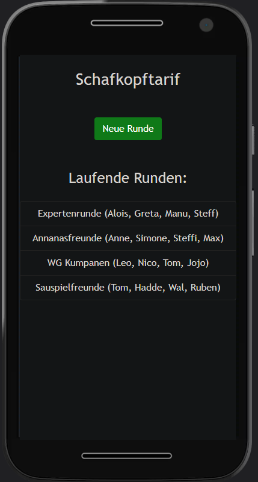
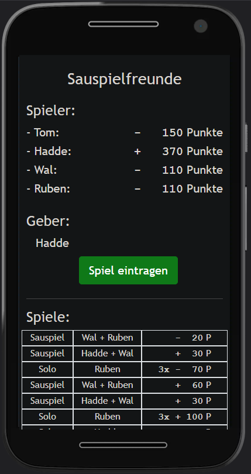
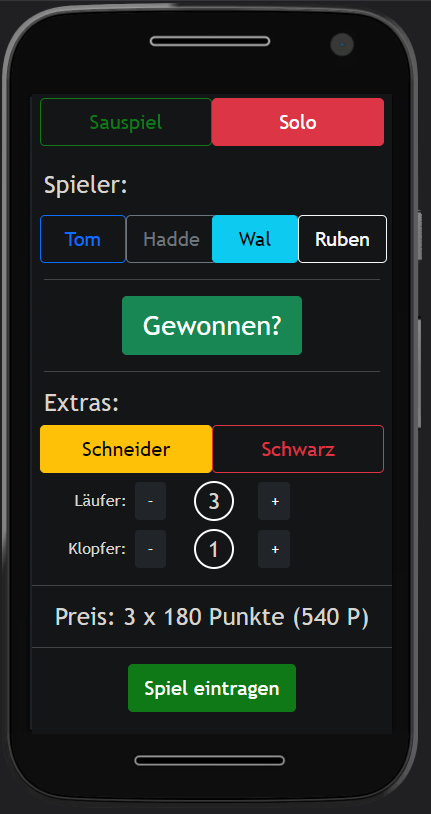

# [Schafkopftarif](https://schafkopftarif.de)

Schafkopftarif is a simple Web App that allows Schafkopf (Card Game) Offline Players to register their plays without relying on Pen and Paper.
It automatically aggregates current earnings for each player.

|  |  |  |

# Test

  
   
  

# Technology

- The App is built using [SVELTE](https://svelte.dev/) as frontend framework.

- Game information is stored locally in the browser, no network connection needed.

- The app can be installed as Progressive Web App on Android